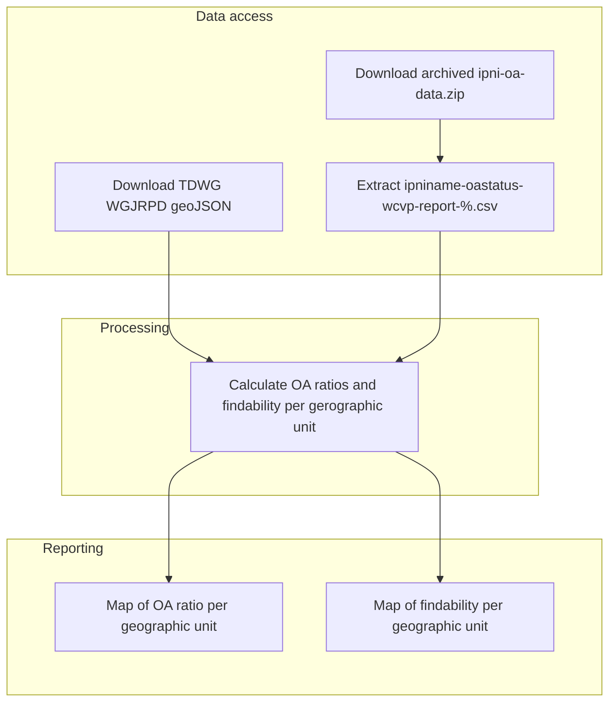

# ipni-oa-map-charts
What's the geographic spread of Open Access ratios and findability of IPNI nomenclatural acts

## Background

to be added

## Research questions

to be added

## Overview

## How to use this repository

to be added

## Contributing

to be added

## Contact information

[Nicky Nicolson](https://github.com/nickynicolson), RBG Kew (n.nicolson@kew.org)

